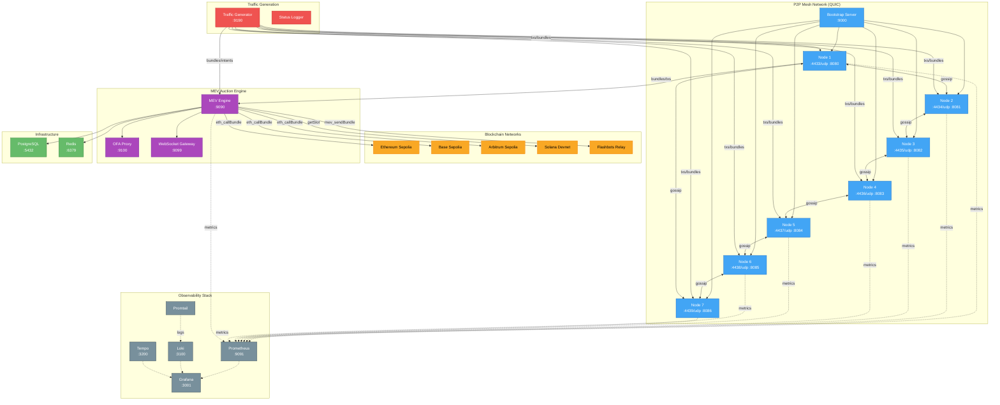
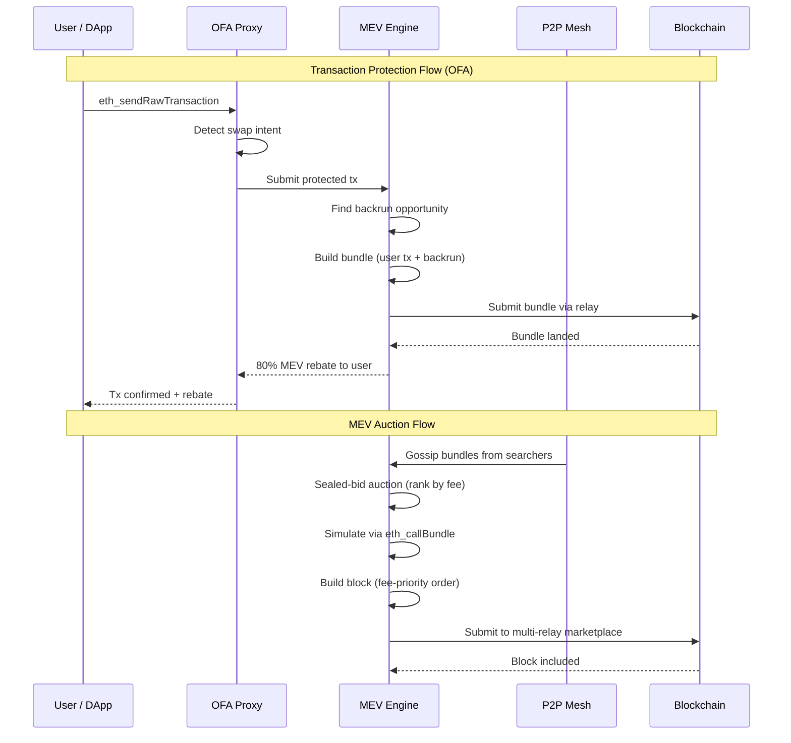
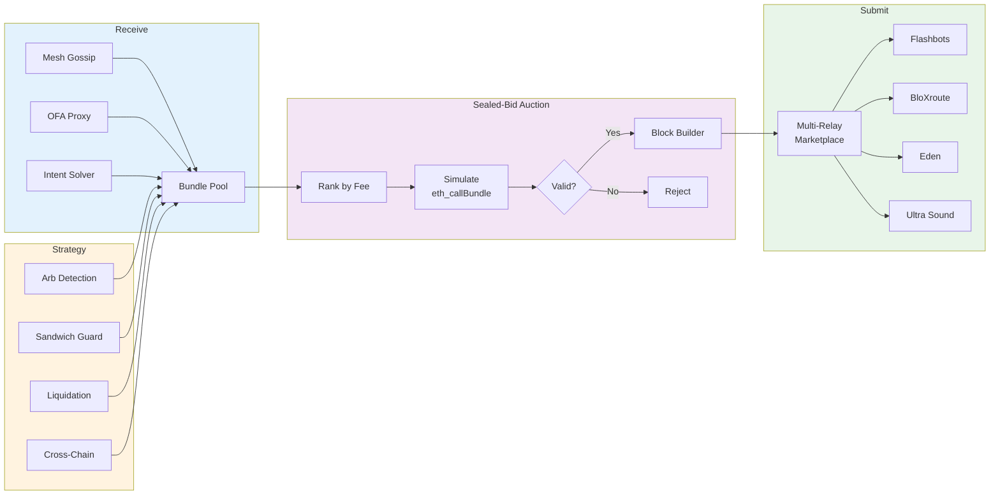
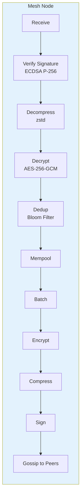
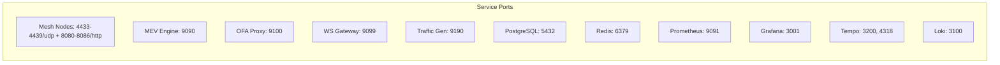

# YoorQuezt — Architecture

## System Overview

## Data Flow

## MEV Pipeline

## Gossip Protocol

## Network Topology

## Tech Stack

| Component | Technology | Purpose |
|-----------|-----------|---------|
| P2P Transport | QUIC + TLS 1.3 | Multiplexed, encrypted peer communication |
| Gossip | Custom batched protocol | Tx/bundle/block propagation |
| Compression | zstd | Reduce bandwidth |
| Encryption | AES-256-GCM | Message confidentiality |
| Signing | ECDSA P-256 | Message authenticity |
| Dedup | Bloom filter | Prevent re-gossip |
| Block Building | Bundle-first, fee-priority | MEV-optimized block construction |
| Simulation | eth_callBundle | Bundle validation |
| Database | PostgreSQL 16 | Relay reputation, auction history |
| Cache | Redis 7 | Hot state, rate limiting |
| Metrics | Prometheus | Time-series metrics |
| Dashboards | Grafana 10.4 | Visualization |
| Tracing | Tempo + OpenTelemetry | Distributed tracing |
| Logs | Loki + Promtail | Centralized log aggregation |
| Contracts | Solidity (Foundry) | Settlement, rebates, intents |
| Language | Go | All backend services |
